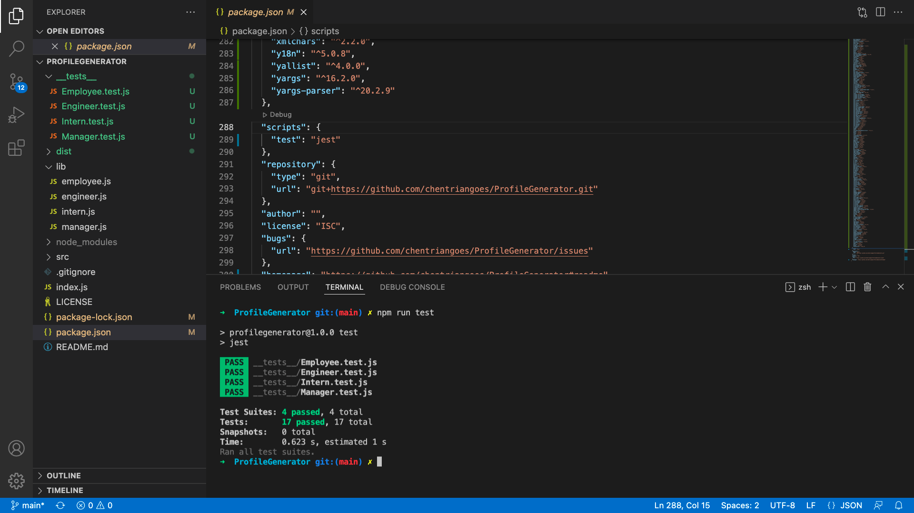

# 🖥 ProfileGenerator
A Node.js command-line application generating a team profile of every member's information for the project management

## 📋 Description

This project is to create a team profile HTML page showing some information about its members by using a command-line application. A series of questions will be prompted to present questions accepting user inputs. An output of a HTML file coded with input given at this command-line application is expected to get generated.This application should also pass all tests.

### 📽 Demonstration

Demo video: [Tests Demo](https://drive.google.com/file/d/1l2OQFrKgAm4aVuv0c9euUdXC2ywjTND2/view?usp=sharing)

Demo video: [HTML Generator Demo](https://drive.google.com/file/d/1Q5pICqK-EW_oFc5ogL196uAGi53ARKqQ/view?usp=sharing)

### 📷 Output
Tests

Team Profile

## 🕹 Technologies

* [Node.js](https://nodejs.org/)
* [Inquirer.js](https://www.npmjs.com/package/inquirer)
* [JEST](https://jestjs.io/docs/getting-started)

## 🛡 License

This repository is licensed under the [MIT license](./LICENSE).

## ☎️ Questions and Links

For any questions about the project/repository please contact me @ [chentriangoes@gmail.com](mailto:chentriangoes@gmail.com)  
GitHub @ [chentriangoes](https://github.com/chentriangoes) 